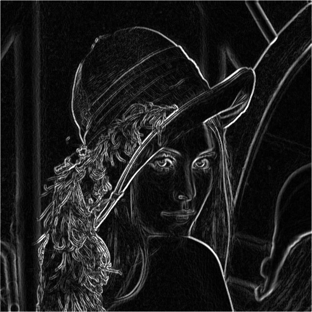
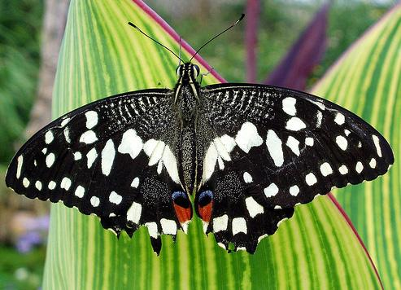
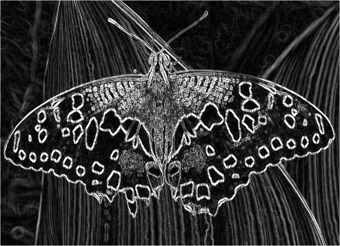

# SobelFilter

This project implements and benchmarks 3 Sobel filter implementations. A custom version, an OpenMP-optimized version, and OpenCV's native Sobel filter.


   


## Usage

```bash
./SobelFilterApp "path/to/input/image.jpeg" "path/to/output/image.jpeg" --mode iters
```


### Parameters

You can specify the following parameters:

* **`@input`**:
    * **Description**: Path to the input image file.
    * **Default**: `lena.jpg`
    * **Example**: `--input "path/to/another/image.jpeg"`

* **`@output`**:
    * **Description**: Path where the resulting image will be saved.
    * **Default**: `out.jpg`
    * **Example**: `--output "results/blurred_output.png"`

* **`@mode`**:
    * **Description**: Selects the application's operating mode.
    * **Default**: `-o`
    * **Options**:
        * `-r`: **Regular Output Generation**. Processes the image using the default (custom implementation) filter and saves the result.
        * `-b`: **Benchmark Mode**. Runs various filter implementations multiple times to measure and compare their performance. No image is saved in this mode.
        * `-o`: **OpenMP Output Generation**. Processes the image using the OpenMP-optimized filter and saves the result.
    * **Example**: `--mode -b`

* **`@iters`**:
    * **Description**: Number of iterations for benchmark mode. This parameter is ignored in other modes.
    * **Default**: `10`
    * **Example**: `--iters 50`


## Dependencies

- [OpenCV](https://opencv.org/) — Open Source Computer Vision Library (tested with version 4.12)
